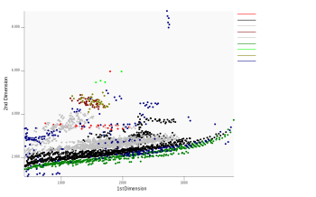
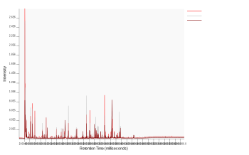
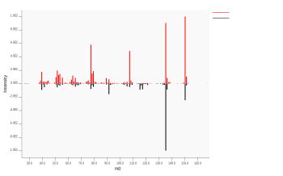

# GSoC-2020
Project Details and Work done during the GSoC 2020 programme
## About the project

**Eclipse SWTChart Project - Extending The Export Options**

See Eclipse SWTChart on [Eclipse](https://projects.eclipse.org/projects/science.swtchart), [Github](https://github.com/eclipse/swtchart)  
See this project on [Google Summer of code](https://summerofcode.withgoogle.com/projects/#5104569337511936)  
Mentor - [Philip Wenig](https://github.com/eselmeister)

**Project Accomplished Milestones**

1. Added SVG Template Export Option

2. Perfomance Improvement in R-Script Export

## SVG Export via Inkscape Template

SVG or Scalable Vector Graphics file is a popular export option when
exporting as images mainly due to its property of retaining quality
when resized (i.e. resolution is changed).
The above property makes SVG files appropriate for images that
contain high details like plots and graphs.

SWTChart now supports an option to be exported to (.svg) format using this lightweight Template Export
Option which has no dependancy to any external library and is much more efficient when exporting multiple series.

An Inkscape Template along with the exporting option was added for each of the following types of chart-

1. LineSeries Chart

2. BarSeries Chart

3. ScatterSeries Chart

PRs for addtion of LineChart to the Template Export-

1. https://github.com/eclipse/swtchart/pull/171

2. https://github.com/eclipse/swtchart/pull/173

PRs for addition of BarChart to the Template Export-

1. https://github.com/eclipse/swtchart/pull/176

PRs for addition of ScatterChart to the Template Export-

1. https://github.com/eclipse/swtchart/pull/184

The above changes added the SVG Template Export option to SWTChart,
However, there were further changes needed for optimized and efficient working of the export option

Following were the PRs related to issues and bug fixing and further optimization-

1. https://github.com/eclipse/swtchart/pull/193

2. https://github.com/eclipse/swtchart/pull/195

3. https://github.com/eclipse/swtchart/pull/197

4. https://github.com/eclipse/swtchart/pull/199

Here are some final sample exports showcasing the template export at work-
Scatter Plot- 
Line Plot-  
Bar Plot- 

